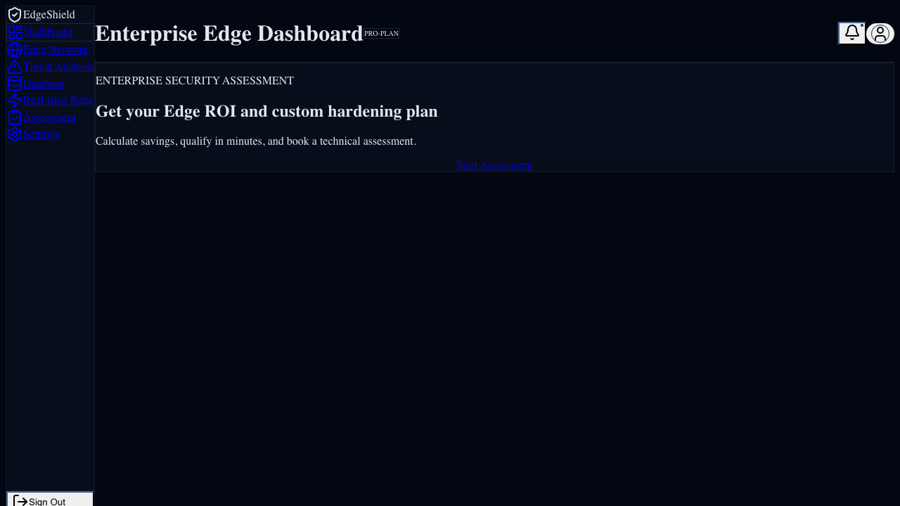

# EdgeShield - Enterprise Edge Security Hub

**EdgeShield** is a next-generation security platform built for Indian mid-market businesses. It delivers enterprise-grade cloud-native security integrated with edge computing to provide real-time threat detection and mitigation.

## Features
- **Global Edge Network**: Low-latency threat interception.
- **AI Anomaly Detection**: Proactive zero-day attack prevention.
- **Premium Dashboard**: Real-time visualization of security events.
- **India Pricing + ROI**: 3 INR pricing tiers and a monthly savings calculator.
- **Lead Capture CTA**: Home `Book Demo` posts to `/api/leads`, with smart mailto fallback.

## Landing Conversion Module (India)
Primary landing (`/`) now includes:
- 3 India-specific plans in INR (`Starter`, `Growth`, `Enterprise`)
- On-page monthly ROI calculator based on:
  - Team size
  - Current monthly tooling cost (INR)
  - Selected plan
- Quick lead form (`Book Demo`) wired to `POST /api/leads`
- Safe fallback CTA to sales email when lead endpoint is unavailable
- Auto-fills fallback mailto with selected plan, lead details, and ROI context

### Screenshot

### Pricing and ROI rationale
- INR-localized pricing reduces buyer friction for India-based procurement teams.
- 3-tier ladder maps cleanly to SMB-midmarket-enterprise buyer maturity.
- ROI estimate combines platform consolidation savings, operations savings, and plan efficiency delta to give a directional monthly value for security leaders.
- Homepage lead capture shortens time-to-contact versus forcing full-page funnel traversal.

## India Pricing Strategy
The assessment flow is optimized for Indian enterprise buyers with transparent monthly pricing:
- **Starter**: `₹69,999/month`
  - Managed WAF + bot defense
  - 24x7 SOC triage
  - Monthly risk reporting
- **Growth**: `₹1,49,999/month`
  - DDoS and API protection
  - SIEM integrations
  - Priority response SLA
- **Enterprise**: `₹3,29,999/month`
  - Dedicated security architect
  - Compliance and audit support
  - Custom SLA

ROI model inputs:
- Team size
- Current tooling cost per month (INR)
- Selected plan

Outputs:
- Estimated monthly savings
- Annualized savings and ROI percentage

## Getting Started
1. `npm install`
2. `npm run dev`

## Environment Variables
Create a `.env.local` file:

- `CONTACT_WEBHOOK_URL` (required for lead delivery)
- `LEAD_WEBHOOK_MAX_ATTEMPTS` (optional, default `3`)
- `LEAD_WEBHOOK_RETRY_BASE_MS` (optional, default `500`)
- `NEXT_PUBLIC_ASSESSMENT_BOOKING_URL` (optional, defaults to Calendly root)
- `NEXT_PUBLIC_SALES_EMAIL` (optional, used by safe mailto fallback, default `sales@example.com`)

## Usage Notes (Pricing + Demo CTA)
- Home page (`/`) includes full India pricing cards, ROI calculator, and quick lead-capture demo form.
- If `/api/leads` is unavailable, `Book Demo` gracefully redirects to a prefilled sales mailto.
- Assessment page (`/assessment`) contains:
  - Full INR pricing cards (3 plans)
  - Monthly ROI calculator (team size + current tooling cost)
  - Lead form that posts to `POST /api/leads`
  - Mailto fallback CTA if endpoint/webhook is unavailable

## Lead Payload Schema (`POST /api/leads`)
Required fields:
- `fullName`, `workEmail` (must be work domain), `company`, `role`
- `companySize`, `assessmentFocus`, `timeline`, `sourcePage`

Numeric inputs:
- `monthlyTrafficGb`, `annualSecuritySpendInr`, `estimatedIncidentsPerMonth`
- `estimatedAnnualSavingsInr`, `estimatedRoiPercent`

Anti-spam fields:
- `website` (honeypot, must be empty)
- `startedAt` (submission time trap)

Server-side wrapper sent to webhook:
- `type: "enterprise_assessment_lead"`
- `submittedAt`, `ip`, `userAgent`, `payload`

## Documentation
- [Architecture Overview](./docs/architecture/overview.md)
- [Security Strategy](./docs/security/strategy.md)
- [API Reference](./docs/api/endpoints.md)
- [Go-To-Market Offer (Enterprise Pilot, India)](./docs/go-to-market/offer.md)

## Team
- **Project Lead**: Master Hans
- **Principal Engineer**: Raj (Indian Avengers)
- **Research**: Anusandhan (Research Lab)

## Daily TPM delivery update (2026-04-22)
- Functional: Launch policy compliance dashboard with drift detection by edge cluster
- Non-functional: Implement signed release artifacts and SBOM export in CI pipeline
